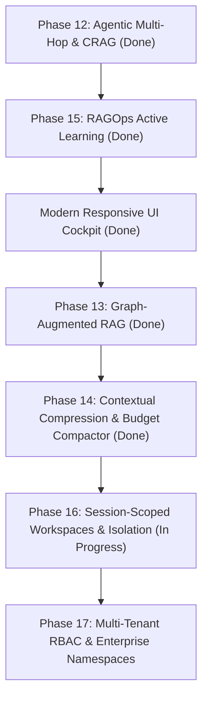

# Work-In-Progress (WIP) & Architecture Status

**Project**: Enterprise Multimodal Hybrid RAG Platform (SOA + Langflow)  
**Target Hardware**: NVIDIA RTX 3050 Laptop (6GB VRAM) + 16GB System RAM  
**Aesthetic Standard**: Modern "Craft" Design System ([`DESIGN.md`](file:///C:/Users/abhi3/Documents/work/rag/DESIGN.md), [`AGENTS.md`](file:///C:/Users/abhi3/Documents/work/rag/AGENTS.md), [getdesign.md](https://getdesign.md))  
**Last Updated**: September 2026  

---

## 1. System Health & Verification Summary

| Metric | Status | Verification Command | Notes |
|---|---|---|---|
| **Unit & Integration Tests** | **75 / 75 Passing** (100%) | `python -m pytest tests/ -q` | Zero skips, zero failures (runs in ~11–27s) |
| **Code Lint & Style** | **0 Errors** | `python -m ruff check .` | Strictly formatted across all packages |
| **FastAPI SOA Gateway** | **Active (HTTP 200)** | `curl http://127.0.0.1:8000/api/v1/health` | Serving UI, REST, and SSE endpoints on `:8000` |
| **Qdrant Vector Database** | **Active (HNSW + Cosine)** | `http://127.0.0.1:6333` | Docker container `rag_qdrant` |
| **Redis Cache & Queue** | **Active** | `127.0.0.1:6379` | Docker container `stockportfolio-redis-1` |
| **Ollama Local LLM** | **Active** | `http://127.0.0.1:11434` | Serving `llama3.2:3b` / `llama3.1:8b` |

---

## 2. Completed Phases & Feature Matrix

| Phase | Milestone | Core Deliverables | Primary Files & Contracts | Status |
| :--- | :--- | :--- | :--- | :--- |
| **Phase 0** | **M0: Scaffolding & Contracts** | Structured logger, Pydantic contracts, config loader, Docker Compose | `contracts/`, `services/common/config.py`, `services/common/logger.py` | ✅ Complete |
| **Phase 1** | **M1: Layout Probing** | 8-page heuristic layout prober, PyMuPDF, Docling layout parser, RapidOCR | `services/ingestion/probe.py`, `services/ingestion/parsers/` | ✅ Complete |
| **Phase 2** | **M2: Dual Indexing** | Heading-hierarchy chunker, table windowing, Qdrant HNSW dense + BM25s sparse | `services/indexing/chunker.py`, `qdrant_store.py`, `bm25_store.py` | ✅ Complete |
| **Phase 3** | **M3: Hybrid Retrieval** | Reciprocal Rank Fusion ($k=60$), FlashRank CPU cross-encoder reranker ($<0.15$ refusal) | `services/retrieval/rrf.py`, `services/retrieval/reranker.py` | ✅ Complete |
| **Phase 4** | **M4: Langflow Flows** | Custom Langflow visual components, JSON flow export template | `components/`, `flows/hybrid_rag_flow.json` | ✅ Complete |
| **Phase 5** | **M5: Scheduler & Reconciler** | Directory watcher (`data/documents/`), SHA-256 deduplication, Webhook dispatcher | `services/scheduler/reconciler.py`, `services/scheduler/dispatcher.py` | ✅ Complete |
| **Phase 6** | **M6: Benchmarking** | Ablation suite (Dense vs Sparse vs Hybrid vs Reranker), operational walkthrough | `tests/integration/test_pipeline.py`, `tests/eval/ablation.py` | ✅ Complete |
| **Phase 7** | **M7: Unified SOA Gateway** | FastAPI REST & SSE streaming gateway, evaluation harness (HitRate, MRR, Faithfulness) | `services/gateway/api.py`, `tests/eval/eval_harness.py` | ✅ Complete |
| **Phase 8** | **M8: Redis Async Queue** | Background worker pool, atomic task popping, worker heartbeat, dead-letter queue (DLQ) | `services/scheduler/queue.py`, `worker.py`, `dlq_manager.py` | ✅ Complete |
| **Phase 9** | **M9: Visual Provenance** | Visual PDF page renderer with highlighted bounding-box overlay, CI regression gate | `services/ingestion/visualizer.py`, `tests/eval/regression_gate.py` | ✅ Complete |
| **Phase 10** | **M10: Conversational Memory** | Multi-session state store, rolling sliding-window context, session REST API | `contracts/session.py`, `services/gateway/session_store.py` | ✅ Complete |
| **Phase 11** | **M11: Deep Multimodal Ingestion**| Structured table markdown extraction, 150 DPI figure crops, multimodal citations | `services/ingestion/multimodal.py`, `scripts/test_phase_11.py` | ✅ Complete |
| **Phase 12** | **M12: Agentic Multi-Hop & CRAG**| Query decomposition, Corrective RAG confidence reflection, multi-hop coordinator | `contracts/agent.py`, `decomposer.py`, `crag.py`, `agentic.py` | ✅ Complete |
| **Phase 13** | **M13: Graph-Augmented RAG (GraphRAG)**| Entity & relation extractor, NetworkX graph store, multi-hop associative traversal, community detection | `contracts/graph.py`, `services/graph/extractor.py`, `store.py`, `traversal.py` | ✅ Complete |
| **Phase 14** | **M14: Contextual Compression**| Salience sentence selector, cross-document redundancy deduplication, wide table column pruning, 8K envelope budget | `contracts/compactor.py`, `services/retrieval/compactor.py`, `tests/unit/test_compactor.py` | ✅ Complete |
| **Phase 15** | **M15: Continuous Eval (RAGOps)** | Active learning thumbs up/down, hard-negative mining on refusal, triplet export | `contracts/feedback.py`, `services/feedback/store.py` | ✅ Complete |
| **UI Overhaul**| **Modern "Craft" Cockpit** | Fully responsive 3-pane cockpit layout, docked provenance inspector, command palette (`⌘K`) | `ui/index.html`, [`DESIGN.md`](file:///C:/Users/abhi3/Documents/work/rag/DESIGN.md), [`AGENTS.md`](file:///C:/Users/abhi3/Documents/work/rag/AGENTS.md) | ✅ Complete |

---

## 3. Current In-Flight Status: Modern "Craft" UI Architecture

The frontend has been upgraded to a **fully responsive 3-pane adaptive cockpit** following [getdesign.md](https://getdesign.md) (Linear / Vercel / Raycast aesthetic):

### What Was Delivered:
1. **Obsidian / Zinc Dark Aesthetic**:
   - `zinc-950` canvas (`#09090b`), `zinc-900/60` translucent cards with `backdrop-filter: blur(16px)`.
   - 1px hairline translucent borders (`border-white/[0.08]`) with top-edge hairline highlight gradients.
   - High-contrast crisp solid white CTA button (`bg-white text-zinc-950 font-medium`) and translucent secondary buttons.
   - Zero generic AI tropes (no purple gradients, no fuzzy drop shadows, no decorative floating blobs).
2. **Docked Side-by-Side Provenance Inspector (`440px`)**:
   - Replaces disruptive modal overlays with a docked right-hand split pane.
   - Clicking citation badges (`[p.3 #1]`) opens the exact rendered PDF page with highlighted bounding-box overlay (`[x0, y0, x1, y1]`) alongside the chat answer.
3. **Adaptive Sidebar Rail (`320px` $\leftrightarrow$ `64px`)**:
   - Toggleable via button or `Ctrl+B` / `⌘B` into an icon-only mini-rail to maximize reading workspace.
4. **Command Palette (`⌘K` / `Ctrl+K`)**:
   - Instant keyboard search for starting sessions, ingesting PDFs, switching retrieval modes, or viewing telemetry.
5. **Full Multi-Viewport Responsiveness**:
   - **Dynamic Viewport Height (`100dvh`)**: Immune to mobile address bar layout shifts.
   - **Mobile (< 768px)**: Single-column stack with off-canvas drawer, backdrop scrim, touch targets $\ge 44\text{px}$, and slide-up bottom sheet with swipe-down indicator.
   - **Tablet (768px–1279px)**: 2-pane layout (64px mini-rail sidebar + central chat arena) with 400px slide-over inspector drawer.
   - **Desktop (≥ 1280px)**: Full 3-pane split-screen cockpit.

---

## 4. Remaining Phases & Roadmap



### Next Phase on the Roadmap:

### **Phase 16: Session-Scoped Workspaces, Document Isolation & Runtime Customization**
- **Goal**: Every chat interaction automatically opens in a dedicated session with a unique session ID, possessing its own scoped documents/files, custom system prompt, and runtime parameters (temperature, model, retrieval mode, compactor budget).
- **Components**:
  - **Contracts**: `SessionParameters`, `ChatSession` extension with `files: list[str]`, `system_prompt: str`, and `UpdateSessionRequest` in `contracts/session.py`.
  - **Memory & Storage**: Scoped Redis persistence and document filter generation in `services/session/manager.py`.
  - **Gateway Integration**: Auto-session creation, parameter injection, and REST endpoints (`PATCH /api/v1/sessions/{id}`, `POST /api/v1/sessions/{id}/files`) in `services/gateway/api.py`.
  - **UI Integration**: Session settings modal / drawer, system prompt persona editor, scoped document toggles, and parameter sliders in `ui/index.html`.
  - **Verification**: Isolated multi-session regression test suite (`tests/unit/test_session_scoped_workspace.py`).

### **Phase 17: Multi-Tenant Security, RBAC & Enterprise Namespaces**
- **Goal**: Enterprise document access control lists (ACLs) and user-isolated Qdrant collection namespaces.
- **Components**:
  - API Key & JWT Bearer authentication gateway middleware.
  - Document-level ACL filtering in Qdrant payload filters (`tenant_id`, `allowed_roles`).
  - Audit logging for enterprise compliance.

---

## 5. Architectural Invariants & Data Contracts

1. **Contracts First**:
   - Any new service must define Pydantic v2 data models in `contracts/` before implementation.
2. **Deterministic Bounding Boxes**:
   - Every candidate and citation chunk preserves normalized coordinates:
     $$\text{bbox} = (x_0, y_0, x_1, y_1), \quad 0.0 \le x, y \le 1.0$$
3. **Corrective RAG (CRAG) Scoring Thresholds**:
   - **CONFIDENT** ($\text{score} \ge 0.45$): Proceed directly to prompt synthesis.
   - **AMBIGUOUS** ($0.15 \le \text{score} < 0.45$): Trigger secondary corrective retrieval hop.
   - **REFUSE** ($\text{score} < 0.15$): Reject answer synthesis; emit grounded safety refusal.
4. **VRAM Preservation on 6GB RTX 3050**:
   - FlashRank cross-encoder reranking runs exclusively on **CPU** (`optimum` / ONNX runtime).
   - VRAM is preserved entirely for the Ollama inference process (`llama3.2:3b` uses ~2.2GB VRAM; `llama3.1:8b` uses ~4.9GB VRAM).
5. **Zero AI Slop Enforced**:
   - All frontend code must comply with [`DESIGN.md`](file:///C:/Users/abhi3/Documents/work/rag/DESIGN.md) and [`AGENTS.md`](file:///C:/Users/abhi3/Documents/work/rag/AGENTS.md).

---

## 6. Operational Cheat Sheet

### Common Development Commands
```powershell
# Run all unit and integration tests (75 tests)
python -m pytest tests/ -q

# Run fast linting
python -m ruff check .

# Start FastAPI SOA Gateway server
python -m uvicorn services.gateway.api:app --host 0.0.0.0 --port 8000 --reload

# Start Background Redis Ingestion Worker
python -m services.scheduler.worker

# Run Automated CI Regression Gate
python tests/eval/regression_gate.py

# Run Multi-Hop Comparative Benchmark (Phases 12 & 15)
python scripts/test_phases_12_and_15.py

# Run GraphRAG & Context Compactor Benchmark (Phases 13 & 14)
python scripts/test_phases_13_and_14.py

# Export RAGOps Triplet Dataset
curl http://127.0.0.1:8000/api/v1/ragops/dataset -o hard_negatives.jsonl
```

### Docker Containers
```powershell
# Check status of Qdrant & Redis containers
docker ps --format "table {{.Names}}\t{{.Status}}\t{{.Ports}}"
```
