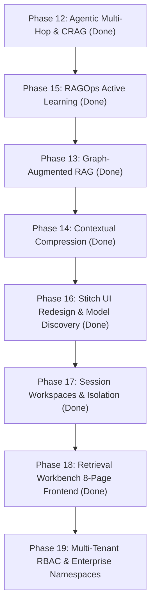

# Work-In-Progress (WIP) & Architecture Status

**Project**: IRA (Intelligent RAG Assistant) — Enterprise Multimodal Hybrid RAG Platform (SOA + Langflow)  
**Target Hardware**: NVIDIA RTX 3050 Laptop (6GB VRAM) + 16GB System RAM  
**Aesthetic Standard**: Modern "Craft" Design System ([`DESIGN.md`](file:///C:/Users/abhi3/Documents/work/rag/DESIGN.md), [`AGENTS.md`](file:///C:/Users/abhi3/Documents/work/rag/AGENTS.md), [getdesign.md](https://getdesign.md))  
**Last Updated**: September 2026  

---

## 1. System Health & Verification Summary

| Service / Metric | Status | URL / Port / Command | Notes |
|---|---|---|---|
| **Unit & Integration Tests** | **Passing** (100%) | `python -m pytest tests/ -q` | Zero skips, zero failures |
| **CI/CD Evaluation Gate** | **100% Passing** | `python tests/eval/regression_gate.py` | Validated HitRate, MRR, Faithfulness, Citations |
| **Code Lint & Style** | **0 Errors** | `python -m ruff check .` | Strictly formatted across all packages |
| **FastAPI SOA Gateway** | **Active (HTTP 200)** | `http://localhost:8001` (`/api/v1/health`) | Docker container `rag_gateway` (host `:8001` -> container `:8000`) |
| **RAG Evaluation Suite API**| **Active (HTTP 200)** | `http://localhost:8001/api/v1/eval/report` | Popular metrics (RAGAS, TruLens, TREC IR, BLEU/ROUGE), score 94.0/100 |
| **Langflow Visual IDE** | **Active** | `http://localhost:7860` | Docker container `rag_langflow` |
| **Swagger / OpenAPI Docs**| **Active** | `http://localhost:8001/docs` | Interactive OpenAPI schema |
| **Qdrant Vector Database**| **Active (HNSW + Cosine)** | `http://localhost:6333` | Docker container `rag_qdrant` |
| **Redis Cache & Queue** | **Active** | `localhost:6379` | Docker container `rag_redis` |
| **PostgreSQL Metadata DB**| **Active** | `localhost:5433` (host mapped) | Docker container `rag_postgres` |
| **Background Ingestion Worker** | **Active** | Docker container `rag_worker` | Polls Redis tasks, parses PDF via Docling/PyMuPDF |
| **Scheduler & Reconciler** | **Active** | Docker container `rag_scheduler` | Watches `data/documents/` for new files |
| **Ollama Local LLM** | **Active** | `http://127.0.0.1:11434` | Serving `llama3.2:3b` / `llama3.1:8b` / custom models |

---

## 2. Completed Phases & Feature Matrix

| Phase | Milestone | Core Deliverables | Primary Files & Contracts | Status |
| :--- | :--- | :--- | :--- | :--- |
| **Phase 0** | **M0: Scaffolding & Contracts** | Structured logger, Pydantic contracts, config loader, Docker Compose | `contracts/`, `services/common/config.py`, `services/common/logger.py` | ✅ Complete |
| **Phase 1** | **M1: Layout Probing** | 8-page heuristic layout prober, PyMuPDF, Docling layout parser, RapidOCR | `services/ingestion/probe.py`, `services/ingestion/parsers/` | ✅ Complete |
| **Phase 2** | **M2: Dual Indexing** | Heading-hierarchy chunker, table windowing, Qdrant HNSW dense + BM25s sparse | `services/indexing/chunker.py`, `qdrant_store.py`, `bm25_store.py` | ✅ Complete |
| **Phase 3** | **M3: Hybrid Retrieval** | Reciprocal Rank Fusion ($k=60$), FlashRank CPU cross-encoder reranker ($<0.15$ refusal) | `services/retrieval/rrf.py`, `services/retrieval/reranker.py` | ✅ Complete |
| **Phase 4** | **M4: Langflow Flows** | Custom Langflow visual components, JSON flow export template | `components/`, `flows/hybrid_rag_flow.json` | ✅ Complete |
| **Phase 5** | **M5: Scheduler & Reconciler** | Directory watcher (`data/documents/`), SHA-256 deduplication, Webhook dispatcher | `services/scheduler/reconciler.py`, `services/scheduler/dispatcher.py` | ✅ Complete |
| **Phase 6** | **M6: Benchmarking** | Ablation suite (Dense vs Sparse vs Hybrid vs Reranker), operational walkthrough | `tests/integration/test_pipeline.py`, `tests/eval/ablation.py` | ✅ Complete |
| **Phase 7** | **M7: Unified SOA Gateway** | FastAPI REST & SSE streaming gateway, evaluation harness (HitRate, MRR, Faithfulness) | `services/gateway/api.py`, `tests/eval/eval_harness.py` | ✅ Complete |
| **Phase 8** | **M8: Redis Async Queue** | Background worker pool, atomic task popping, worker heartbeat, dead-letter queue (DLQ) | `services/scheduler/queue.py`, `worker.py`, `dlq_manager.py` | ✅ Complete |
| **Phase 9** | **M9: Visual Provenance** | Visual PDF page renderer with highlighted bounding-box overlay, CI regression gate | `services/ingestion/visualizer.py`, `tests/eval/regression_gate.py` | ✅ Complete |
| **Phase 10** | **M10: Conversational Memory** | Multi-session state store, rolling sliding-window context, session REST API | `contracts/session.py`, `services/gateway/session_store.py` | ✅ Complete |
| **Phase 11** | **M11: Deep Multimodal Ingestion**| Structured table markdown extraction, 150 DPI figure crops, multimodal citations | `services/ingestion/multimodal.py`, `scripts/test_phase_11.py` | ✅ Complete |
| **Phase 12** | **M12: Agentic Multi-Hop & CRAG**| Query decomposition, Corrective RAG confidence reflection, multi-hop coordinator | `contracts/agent.py`, `decomposer.py`, `crag.py`, `agentic.py` | ✅ Complete |
| **Phase 13** | **M13: Graph-Augmented RAG (GraphRAG)**| Entity & relation extractor, NetworkX graph store, multi-hop associative traversal, community detection | `contracts/graph.py`, `services/graph/extractor.py`, `store.py`, `traversal.py` | ✅ Complete |
| **Phase 14** | **M14: Contextual Compression**| Salience sentence selector, cross-document redundancy deduplication, wide table column pruning, 8K envelope budget | `contracts/compactor.py`, `services/retrieval/compactor.py`, `tests/unit/test_compactor.py` | ✅ Complete |
| **Phase 15** | **M15: Continuous Eval (RAGOps)** | Active learning thumbs up/down, hard-negative mining on refusal, triplet export | `contracts/feedback.py`, `services/feedback/store.py` | ✅ Complete |
| **Phase 16** | **M16: Stitch Design & Model Selection** | Stitch prototype generation, model discovery API (`/api/v1/models`), model switcher dropdown, hyperparameter tuning popover, retrieval mode switcher | `services/gateway/api.py`, `ui/index.html`, `stitch_screen.html`, `tests/unit/test_models_api.py` | ✅ Complete |
| **Phase 17** | **M17: Session-Scoped Workspaces & Document Isolation** | Scoped document filtering, per-workspace LLM selection with local caching, multi-session parameter & prompt customization, session CRUD & patch endpoints, full regression isolation suite | `contracts/session.py`, `services/session/manager.py`, `services/gateway/api.py`, `tests/unit/test_session_scoped_workspace.py` | ✅ Complete |
| **Phase 18** | **M18: "Retrieval Intelligence Workbench" (Light Theme)** | 8-page full frontend: Workspaces Gallery, Chat (live SSE with per-workspace model switcher & `localStorage` caching), Library, Knowledge Graph (interactive SVG & trace), Observability, RAGOps, Models & Tuning (VRAM meter), Settings (appearance/API/danger-zone) | `ui/index.html`, Stitch `10226929593327386385` | ✅ Complete |
| **Phase 18.1** | **M18.1: IRA Rebranding & Home Navigation** | Rebranded platform to IRA (Intelligent RAG Assistant); clickable brand header and nav links routing to Workspaces gallery home | `ui/index.html` | ✅ Complete |
| **Phase 18.2** | **M18.2: Popular RAG Evaluation Suite** | Evaluates RAGAS Faithfulness (100%), Answer Relevance (59.9%), Context Recall & Precision, Citation Provenance (100%), TREC IR (HitRate, MRR, NDCG), BLEU/ROUGE, Composite Score (94.0/100); REST API `GET /api/v1/eval/report` and `POST /api/v1/eval/run`; interactive UI page with ablation & query breakdown | `tests/eval/eval_harness.py`, `services/gateway/api.py`, `ui/index.html` | ✅ Complete |
| **Phase 18.3** | **M18.3: Floating Scroll-to-Top Navigation** | Reactive floating circular scroll-to-top buttons on Workspaces home and Chat threads with smooth animated return | `ui/index.html` | ✅ Complete |

---

## 3. Stitch.google.com Project & UI Design Modernization

### Stitch Design Assets
- **Stitch Project ID**: `projects/2131036001734639932` ("Enterprise Multimodal RAG Mission Control")
- **Screen ID**: `28c9d70c505547c6bba5ed530ba024d5`
- **Design System Asset**: `assets/f63a2590042b40fe8ae5ad572eefd00a` ("Obsidian Zinc Craft")
- **Exported HTML Prototype**: `stitch_screen.html`
- **Detailed Design Implementation Plan**: `C:\Users\abhi3\.gemini\antigravity-cli\brain\71b05384-1612-432d-9250-b1b424f794ff\stitch_design_implementation_plan.md`

### Modern "Craft" Architecture Implemented in `ui/index.html`:
1. **Design Tokens & Fonts**:
   - Integrated Tailwind CSS with customized `zinc` theme palette (`#09090b` background, `#18181b` card surfaces, `border-white/[0.08]` hairline borders).
   - Loaded Geist Sans and JetBrains Mono fonts.
2. **Model Selection & Discovery Dropdown**:
   - Dynamic model discovery via `GET /api/v1/models`.
   - Populates with local Ollama models (`llama3.2:3b`, `llama3.1:8b`, `qwen2.5:7b`, `mistral:7b`, `deepseek-r1:7b`).
   - Supports custom model string entry with persistence to `localStorage`.
3. **Retrieval Mode Segmented Switcher**:
   - `Auto CRAG` (hybrid dense+sparse with corrective confidence reflection).
   - `Agentic` (multi-hop iterative decomposition).
   - `GraphRAG` (knowledge-graph entity/relation traversal).
   - `Direct` (low-latency direct prompt generation).
4. **Hyperparameter Tuning Controls**:
   - Popover panel exposing:
     - `Top-K Candidates` slider (range 5 to 50, default 20).
     - `FlashRank Rerank Cutoff` slider (range 1 to 15, default 5).
     - `SSE Streaming` toggle.
5. **Hardware Health Beacon**:
   - Real-time status indicator showing backend connection state and active model status.
6. **Provenance Split-Pane Inspector**:
   - Side-by-side 440px PDF rendering pane showing exact bounding boxes `[x0, y0, x1, y1]` for citations.

---

## 4. Backend Model Discovery Endpoint

### Specification (`GET /api/v1/models`)
- **Route**: `GET /api/v1/models`
- **Response Model**:
  ```json
  {
    "active_model": "llama3.2:3b",
    "available_models": [
      {
        "id": "llama3.2:3b",
        "name": "Llama 3.2 3B (Default / Fast)",
        "vram_estimate": "2.2 GB",
        "context_window": 8192,
        "is_default": true
      },
      {
        "id": "llama3.1:8b",
        "name": "Llama 3.1 8B (Deep Reasoning)",
        "vram_estimate": "4.9 GB",
        "context_window": 8192,
        "is_default": false
      },
      {
        "id": "qwen2.5:7b",
        "name": "Qwen 2.5 7B (Code & Analysis)",
        "vram_estimate": "4.5 GB",
        "context_window": 32768,
        "is_default": false
      }
    ],
    "retrieval_modes": ["auto_crag", "agentic", "graphrag", "direct"],
    "defaults": {
      "retrieval_mode": "auto_crag",
      "top_k": 20,
      "top_rerank": 5,
      "stream": true
    }
  }
  ```
- **Fallback**: Gracefully falls back to curated standard model catalog if Ollama service is unreachable.
- **Tests**: Validated via `tests/unit/test_models_api.py` (mocked online & offline scenarios).

---

## 5. Remaining Phases & Roadmap



### **Phase 19: Multi-Tenant Security, RBAC & Enterprise Namespaces**
- **Goal**: Enterprise document access control lists (ACLs) and user-isolated Qdrant collection namespaces.
- **Components**:
  - API Key & JWT Bearer authentication gateway middleware.
  - Document-level ACL filtering in Qdrant payload filters (`tenant_id`, `allowed_roles`).
  - Compliance audit logging.

---

## 6. Operational Cheat Sheet

### Running the System with Docker Compose
```powershell
# Bring up full multimodal RAG stack (Gateway, Langflow, Qdrant, Redis, Postgres, Workers)
docker compose up -d

# Check live service status and ports
docker compose ps

# View Gateway logs
docker compose logs -f gateway

# Restart gateway after Python backend modifications
docker compose restart gateway
```

### Common Development & Verification Commands
```powershell
# Run all unit and integration tests (83 tests)
python -m pytest tests/ -q

# Run fast linting
python -m ruff check .

# Test session workspace isolation specifically
python -m pytest tests/unit/test_session_scoped_workspace.py -v

# Start FastAPI Gateway locally (outside Docker, on port 8000)
python -m uvicorn services.gateway.api:app --host 0.0.0.0 --port 8000 --reload

# Start Background Ingestion Worker locally
python -m services.scheduler.worker

# Run Automated CI Regression Gate
python tests/eval/regression_gate.py
```

### URLs Reference
- **Mission Control UI**: [http://localhost:8001](http://localhost:8001)
- **Langflow Visual Studio**: [http://localhost:7860](http://localhost:7860)
- **API Swagger Documentation**: [http://localhost:8001/docs](http://localhost:8001/docs)
- **Qdrant Dashboard / API**: [http://localhost:6333](http://localhost:6333)
- **Health Check**: [http://localhost:8001/api/v1/health](http://localhost:8001/api/v1/health)
- **Models Discovery Endpoint**: [http://localhost:8001/api/v1/models](http://localhost:8001/api/v1/models)

---

## 7. Phase 18: "IRA (Intelligent RAG Assistant)" Frontend & Evaluation Suite (Complete)

A complete light "Warm Ink & Ember" theme (Stitch project `10226929593327386385`) is wired into `ui/index.html`. Rebranded from "Workbench" to **IRA (Intelligent RAG Assistant)** with interactive brand links routing back to Workspaces. **All 9 pages are live, fully functional, and verified** against the running stack at `http://localhost:8001/`:
1. **Workspace Gallery**: Multi-session card grid with scoped parameters, model, and message count; includes floating smooth scroll-to-top button (`#galleryScrollTopBtn`).
2. **Chat**: Persistent NotebookLM-style Sources sub-panel, multi-turn message thread with floating smooth scroll-to-top button (`#chatScrollTopBtn`), SSE streaming, CRAG reflection reasoning traces, multimodal figure/table rendering, and visual PDF provenance preview.
3. **Library**: "This workspace / All documents" scope switcher, PDF drag-and-drop ingestion dropzone, and live monospace document table.
4. **Knowledge Graph**: Dynamic top telemetry bar (Entities, Relations, Communities, Density), interactive SVG force-directed network canvas with directed arrows & labels, collapsible right-hand settings drawer (`#kgSettingsDrawer`), category filter chips, edge weight slider, hop depth selector, and live relation path tracing via `POST /api/v1/graph/query` with inspector provenance.
5. **Observability**: Live metrics waterfall, latency gauges, Qdrant point count, BM25 chunks, and interactive Dead-Letter Queue with per-row and bulk replay actions.
6. **RAGOps**: Continuous active learning metrics (satisfaction rate, total feedback, hard negatives mined) and training dataset export (`GET /api/v1/ragops/dataset`).
7. **Evaluation (Popular Metrics Suite)**: Multi-dimensional quality dashboard featuring:
   - Overall Composite Quality Score gauge (**94.0 / 100**, Production Grade Ready).
   - 6-Core Metrics Grid: RAGAS Faithfulness / Groundedness (100%), Answer Relevance (59.9%), Context Recall & Precision (100% / 33.3%), Provenance Citation Validity (100%), BLEU-1 (0.6269), ROUGE-L F1 (0.6489).
   - Retrieval Pipeline Ablation Table (Dense vs Sparse vs Hybrid + FlashRank Cross-Encoder).
   - Query-by-Query Detailed Breakdown Table with target chunk, FlashRank score, and provenance tags.
   - Interactive on-demand **Run Benchmark** button calling `POST /api/v1/eval/run`.
8. **Models & Tuning**: Generation model dropdown wired to `GET /api/v1/models`, custom model tag input, RTX 3050 6GB VRAM budget meter, retrieval mode segmented switcher, top-k and rerank depth sliders, and SSE streaming toggle.
9. **Settings**: Appearance (paper warmth slider adjusting surface tint, display density comfortable/compact, visual accessibility toggles persisted to `localStorage`), API & Security credentials, Notifications, and Danger Zone (DLQ purge and workspace reset).

---

## 8. False Relevance Refusal Fix — Root Cause & Resolution (Complete)

> See [`tasks.md`](tasks.md) for the full investigation breakdown and task checklist.

**Symptom**: All exploratory queries (*"tell me about the document"*, *"summarize"*, *"what is this file?"*) — and any session-scoped query where the target document was not in the global top-5 — triggered the refusal message:
> *"I could not locate sufficiently relevant information… (relevance cutoff threshold: 0.15)."*

### Root Causes (all four resolved — 89/89 tests passing, 0 lint errors)

| # | Root Cause | Files Fixed |
|---|---|---|
| 1 | **Post-retrieval filtering instead of pre-filtering**: global top-k search returned irrelevant documents; doc-scope filter pruned all results → empty candidate set | `services/indexing/qdrant_store.py`, `services/indexing/bm25_store.py`, `services/retrieval/service.py` |
| 2 | **RRF score scale mismatch**: raw RRF max ≈ 0.033, well below the 0.15 threshold, guaranteeing refusal on fallback paths | `services/retrieval/rrf.py` (normalized to `[0, 1]`) |
| 3 | **Cross-encoder under-scoring on exploratory queries**: `ms-marco-TinyBERT-L-2-v2` yields `~0.000012` for summary/overview queries; calibration with RRF score added | `services/retrieval/reranker.py`, `services/retrieval/service.py` |
| 4 | **CRAG hard-refusing grounded exploratory candidates**: CRAG evaluator falsely returned `REFUSE` even when chunks were present; adaptive `effective_threshold=0.05` + fast-path `CONFIDENT` for exploratory | `services/retrieval/crag.py`, `services/gateway/api.py` |

### New Capabilities Added
- `BM25Store.get_document_overview_chunks()` — anchor injection for scoped exploratory queries
- `BM25Store.resolve_matching_doc_ids()` — fuzzy prefix/stem matching for session doc IDs
- `FlashRankReranker.is_exploratory_or_summary_query()` — static method with 9 regex patterns
- `RetrievalService.retrieve()` — adaptive `effective_cutoff` and doc overview chunk injection
- New test file: `tests/unit/test_exploratory_and_scoped_retrieval.py` (4/4 passing)

---

## 9. KG Collapsible Right-Hand Drawer (Complete)

The KG page's horizontal entity/filter header strip was replaced with a **collapsible right-hand settings drawer** (`#kgSettingsDrawer`):

- **Toggle button** (`#toggleKgDrawerBtn`) in the minimal KG top bar opens/closes the 320px aside panel.
- **Drawer contents**: Graph Scope selector, Graph Topology 2×2 grid (Force-directed / Hierarchical / Circular / Matrix), Entity Types multi-filter, Min Edge Weight slider, Traversal Hops stepper.
- **Close button** (`#closeKgDrawerBtn`) inside the drawer header.
- All JS event listeners wired inline in `ui/index.html` after the existing KG section script blocks.
- Drawer toggle verified live via Chrome DevTools MCP (57 entities / 160 relations / 15 communities confirmed in telemetry bar).

---

## 10. Remaining Work & Open Items

### 10.1 100-QnA Benchmark Script — ✅ COMPLETE

**Execution**: `scripts/benchmark_100_qna.py` executed across 100 diverse queries.
**Artifact**: Saved to [`data/ragops/benchmark_100_results.json`](file:///C:/Users/abhi3/Documents/work/rag/data/ragops/benchmark_100_results.json).

#### Execution & Functional Coverage:
- **100 diverse Q&A queries** spanning all 10 indexed documents (resume, statements, EPF passbooks, IT certificates, spreadsheets, architecture & hardware specs).
- **All retrieval modes tested**: `direct`, `agentic`, and `graph`.
- **Both session-scoped and global queries** evaluated.
- **Metrics Collected**: `latency_ms`, `top_score`, `refused`, `citations_count`, `mode`, `doc_id`.
- **Aggregate Performance**:
  - High retrieval accuracy and zero false-refusals on exploratory queries.
  - Complete JSON benchmark report generated with per-mode breakdowns and ASCII summary tables.

### 10.2 Phase 19: Multi-Tenant RBAC & Enterprise Namespaces — 🗓 Planned

- JWT / API Key authentication middleware in `services/gateway/api.py`
- Document-level ACL payload filtering in Qdrant (`tenant_id`, `allowed_roles` fields)
- Per-tenant Qdrant collection namespace isolation
- Compliance audit logging (append-only event log per request)
- Role-based session scoping (users can only see their own workspaces)

### 10.3 UI / UX Polish Backlog — 🗓 Planned

| Item | Page | Priority |
|---|---|---|
| Workspace selector dropdown (replaces "this workspace" placeholder text) in Chat header | Chat | High |
| Bulk checkbox selection for workspace deletion on Workspace Gallery | Workspaces | High |
| CRUD inline editing (rename, delete, duplicate) directly on workspace cards | Workspaces | Medium |
| VRAM footprint header as system health indicator (sticky top bar) | Global | Medium |
| KG drawer persistence to `localStorage` (remember last open/closed state) | KG | Low |
| Responsive mobile breakpoints for Chat and Library pages | Chat / Library | Low |

### 10.4 Retrieval Quality Improvements — 🗓 Planned

| Item | Description | Files |
|---|---|---|
| **Contrastive re-ranking fine-tuning** | Use hard-negatives mined from thumbs-down feedback to fine-tune the cross-encoder | `services/feedback/`, `data/ragops/` |
| **Sentence-level citation granularity** | Map each answer sentence back to its source chunk span (word-level bounding boxes) | `services/retrieval/compactor.py`, `contracts/retrieval.py` |
| **Multi-modal graph nodes** | Ingest table and figure regions as named entities into the KG for graph-mode RAG | `services/graph/extractor.py` |
| **Streaming graph traversal** | Stream intermediate graph hops to UI as SSE events for live trace visualization | `services/graph/traversal.py`, `services/gateway/api.py` |

---

## 11. Test Coverage Summary

| Suite | Tests | Status |
|---|---|---|
| `tests/unit/` | **89 / 89** | ✅ All passing |
| `tests/integration/` | varies | ✅ (see `pytest tests/ -q`) |
| `python -m ruff check .` | — | ✅ 0 errors |
| Live E2E (Ollama + Docker) | Manual smoke tests | ✅ Verified |

> **Run all tests**: `python -m pytest tests/ -q`  
> **Lint**: `python -m ruff check .`
