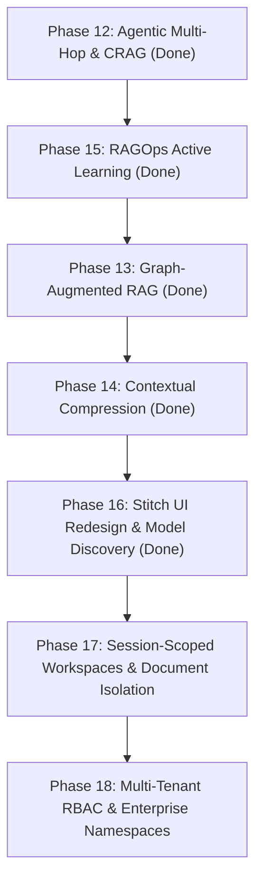

# Work-In-Progress (WIP) & Architecture Status

**Project**: Enterprise Multimodal Hybrid RAG Platform (SOA + Langflow)  
**Target Hardware**: NVIDIA RTX 3050 Laptop (6GB VRAM) + 16GB System RAM  
**Aesthetic Standard**: Modern "Craft" Design System ([`DESIGN.md`](file:///C:/Users/abhi3/Documents/work/rag/DESIGN.md), [`AGENTS.md`](file:///C:/Users/abhi3/Documents/work/rag/AGENTS.md), [getdesign.md](https://getdesign.md))  
**Last Updated**: September 2026  

---

## 1. System Health & Verification Summary

| Service / Metric | Status | URL / Port / Command | Notes |
|---|---|---|---|
| **Unit & Integration Tests** | **77 / 77 Passing** (100%) | `python -m pytest tests/ -q` | Zero skips, zero failures (includes `test_models_api.py`) |
| **Code Lint & Style** | **0 Errors** | `python -m ruff check .` | Strictly formatted across all packages |
| **FastAPI SOA Gateway** | **Active (HTTP 200)** | `http://localhost:8001` (`/api/v1/health`) | Docker container `rag_gateway` (host `:8001` -> container `:8000`) |
| **Langflow Visual IDE** | **Active** | `http://localhost:7860` | Docker container `rag_langflow` |
| **Swagger / OpenAPI Docs**| **Active** | `http://localhost:8001/docs` | Interactive OpenAPI schema |
| **Qdrant Vector Database**| **Active (HNSW + Cosine)** | `http://localhost:6333` | Docker container `rag_qdrant` |
| **Redis Cache & Queue** | **Active** | `localhost:6379` | Docker container `rag_redis` |
| **PostgreSQL Metadata DB**| **Active** | `localhost:5433` (host mapped) | Docker container `rag_postgres` |
| **Background Ingestion Worker** | **Active** | Docker container `rag_worker` | Polls Redis tasks, parses PDF via Docling/PyMuPDF |
| **Scheduler & Reconciler** | **Active** | Docker container `rag_scheduler` | Watches `data/documents/` for new files |
| **Ollama Local LLM** | **Active** | `http://127.0.0.1:11434` | Serving `llama3.2:3b` / `llama3.1:8b` / custom models |

---

## 2. Completed Phases & Feature Matrix

| Phase | Milestone | Core Deliverables | Primary Files & Contracts | Status |
| :--- | :--- | :--- | :--- | :--- |
| **Phase 0** | **M0: Scaffolding & Contracts** | Structured logger, Pydantic contracts, config loader, Docker Compose | `contracts/`, `services/common/config.py`, `services/common/logger.py` | ✅ Complete |
| **Phase 1** | **M1: Layout Probing** | 8-page heuristic layout prober, PyMuPDF, Docling layout parser, RapidOCR | `services/ingestion/probe.py`, `services/ingestion/parsers/` | ✅ Complete |
| **Phase 2** | **M2: Dual Indexing** | Heading-hierarchy chunker, table windowing, Qdrant HNSW dense + BM25s sparse | `services/indexing/chunker.py`, `qdrant_store.py`, `bm25_store.py` | ✅ Complete |
| **Phase 3** | **M3: Hybrid Retrieval** | Reciprocal Rank Fusion ($k=60$), FlashRank CPU cross-encoder reranker ($<0.15$ refusal) | `services/retrieval/rrf.py`, `services/retrieval/reranker.py` | ✅ Complete |
| **Phase 4** | **M4: Langflow Flows** | Custom Langflow visual components, JSON flow export template | `components/`, `flows/hybrid_rag_flow.json` | ✅ Complete |
| **Phase 5** | **M5: Scheduler & Reconciler** | Directory watcher (`data/documents/`), SHA-256 deduplication, Webhook dispatcher | `services/scheduler/reconciler.py`, `services/scheduler/dispatcher.py` | ✅ Complete |
| **Phase 6** | **M6: Benchmarking** | Ablation suite (Dense vs Sparse vs Hybrid vs Reranker), operational walkthrough | `tests/integration/test_pipeline.py`, `tests/eval/ablation.py` | ✅ Complete |
| **Phase 7** | **M7: Unified SOA Gateway** | FastAPI REST & SSE streaming gateway, evaluation harness (HitRate, MRR, Faithfulness) | `services/gateway/api.py`, `tests/eval/eval_harness.py` | ✅ Complete |
| **Phase 8** | **M8: Redis Async Queue** | Background worker pool, atomic task popping, worker heartbeat, dead-letter queue (DLQ) | `services/scheduler/queue.py`, `worker.py`, `dlq_manager.py` | ✅ Complete |
| **Phase 9** | **M9: Visual Provenance** | Visual PDF page renderer with highlighted bounding-box overlay, CI regression gate | `services/ingestion/visualizer.py`, `tests/eval/regression_gate.py` | ✅ Complete |
| **Phase 10** | **M10: Conversational Memory** | Multi-session state store, rolling sliding-window context, session REST API | `contracts/session.py`, `services/gateway/session_store.py` | ✅ Complete |
| **Phase 11** | **M11: Deep Multimodal Ingestion**| Structured table markdown extraction, 150 DPI figure crops, multimodal citations | `services/ingestion/multimodal.py`, `scripts/test_phase_11.py` | ✅ Complete |
| **Phase 12** | **M12: Agentic Multi-Hop & CRAG**| Query decomposition, Corrective RAG confidence reflection, multi-hop coordinator | `contracts/agent.py`, `decomposer.py`, `crag.py`, `agentic.py` | ✅ Complete |
| **Phase 13** | **M13: Graph-Augmented RAG (GraphRAG)**| Entity & relation extractor, NetworkX graph store, multi-hop associative traversal, community detection | `contracts/graph.py`, `services/graph/extractor.py`, `store.py`, `traversal.py` | ✅ Complete |
| **Phase 14** | **M14: Contextual Compression**| Salience sentence selector, cross-document redundancy deduplication, wide table column pruning, 8K envelope budget | `contracts/compactor.py`, `services/retrieval/compactor.py`, `tests/unit/test_compactor.py` | ✅ Complete |
| **Phase 15** | **M15: Continuous Eval (RAGOps)** | Active learning thumbs up/down, hard-negative mining on refusal, triplet export | `contracts/feedback.py`, `services/feedback/store.py` | ✅ Complete |
| **Phase 16** | **M16: Stitch Design & Model Selection** | Stitch prototype generation, model discovery API (`/api/v1/models`), model switcher dropdown, hyperparameter tuning popover, retrieval mode switcher | `services/gateway/api.py`, `ui/index.html`, `stitch_screen.html`, `tests/unit/test_models_api.py` | ✅ Complete |

---

## 3. Stitch.google.com Project & UI Design Modernization

### Stitch Design Assets
- **Stitch Project ID**: `projects/2131036001734639932` ("Enterprise Multimodal RAG Mission Control")
- **Screen ID**: `28c9d70c505547c6bba5ed530ba024d5`
- **Design System Asset**: `assets/f63a2590042b40fe8ae5ad572eefd00a` ("Obsidian Zinc Craft")
- **Exported HTML Prototype**: `stitch_screen.html`
- **Detailed Design Implementation Plan**: `C:\Users\abhi3\.gemini\antigravity-cli\brain\71b05384-1612-432d-9250-b1b424f794ff\stitch_design_implementation_plan.md`

### Modern "Craft" Architecture Implemented in `ui/index.html`:
1. **Design Tokens & Fonts**:
   - Integrated Tailwind CSS with customized `zinc` theme palette (`#09090b` background, `#18181b` card surfaces, `border-white/[0.08]` hairline borders).
   - Loaded Geist Sans and JetBrains Mono fonts.
2. **Model Selection & Discovery Dropdown**:
   - Dynamic model discovery via `GET /api/v1/models`.
   - Populates with local Ollama models (`llama3.2:3b`, `llama3.1:8b`, `qwen2.5:7b`, `mistral:7b`, `deepseek-r1:7b`).
   - Supports custom model string entry with persistence to `localStorage`.
3. **Retrieval Mode Segmented Switcher**:
   - `Auto CRAG` (hybrid dense+sparse with corrective confidence reflection).
   - `Agentic` (multi-hop iterative decomposition).
   - `GraphRAG` (knowledge-graph entity/relation traversal).
   - `Direct` (low-latency direct prompt generation).
4. **Hyperparameter Tuning Controls**:
   - Popover panel exposing:
     - `Top-K Candidates` slider (range 5 to 50, default 20).
     - `FlashRank Rerank Cutoff` slider (range 1 to 15, default 5).
     - `SSE Streaming` toggle.
5. **Hardware Health Beacon**:
   - Real-time status indicator showing backend connection state and active model status.
6. **Provenance Split-Pane Inspector**:
   - Side-by-side 440px PDF rendering pane showing exact bounding boxes `[x0, y0, x1, y1]` for citations.

---

## 4. Backend Model Discovery Endpoint

### Specification (`GET /api/v1/models`)
- **Route**: `GET /api/v1/models`
- **Response Model**:
  ```json
  {
    "active_model": "llama3.2:3b",
    "available_models": [
      {
        "id": "llama3.2:3b",
        "name": "Llama 3.2 3B (Default / Fast)",
        "vram_estimate": "2.2 GB",
        "context_window": 8192,
        "is_default": true
      },
      {
        "id": "llama3.1:8b",
        "name": "Llama 3.1 8B (Deep Reasoning)",
        "vram_estimate": "4.9 GB",
        "context_window": 8192,
        "is_default": false
      },
      {
        "id": "qwen2.5:7b",
        "name": "Qwen 2.5 7B (Code & Analysis)",
        "vram_estimate": "4.5 GB",
        "context_window": 32768,
        "is_default": false
      }
    ],
    "retrieval_modes": ["auto_crag", "agentic", "graphrag", "direct"],
    "defaults": {
      "retrieval_mode": "auto_crag",
      "top_k": 20,
      "top_rerank": 5,
      "stream": true
    }
  }
  ```
- **Fallback**: Gracefully falls back to curated standard model catalog if Ollama service is unreachable.
- **Tests**: Validated via `tests/unit/test_models_api.py` (mocked online & offline scenarios).

---

## 5. Remaining Phases & Roadmap



### **Phase 17: Session-Scoped Workspaces, Document Isolation & Runtime Customization**
- **Goal**: Every chat interaction automatically opens in a dedicated session with a unique session ID, possessing its own scoped documents/files, custom system prompt, and runtime parameters.
- **Components**:
  - `SessionParameters` contract in `contracts/session.py`.
  - Scoped document filter generation in `services/session/manager.py`.
  - Session patch endpoints (`PATCH /api/v1/sessions/{id}`, `POST /api/v1/sessions/{id}/files`).
  - Isolated multi-session regression test suite (`tests/unit/test_session_scoped_workspace.py`).

### **Phase 18: Multi-Tenant Security, RBAC & Enterprise Namespaces**
- **Goal**: Enterprise document access control lists (ACLs) and user-isolated Qdrant collection namespaces.
- **Components**:
  - API Key & JWT Bearer authentication gateway middleware.
  - Document-level ACL filtering in Qdrant payload filters (`tenant_id`, `allowed_roles`).
  - Compliance audit logging.

---

## 6. Operational Cheat Sheet

### Running the System with Docker Compose
```powershell
# Bring up full multimodal RAG stack (Gateway, Langflow, Qdrant, Redis, Postgres, Workers)
docker compose up -d

# Check live service status and ports
docker compose ps

# View Gateway logs
docker compose logs -f gateway

# Restart gateway after Python backend modifications
docker compose restart gateway
```

### Common Development & Verification Commands
```powershell
# Run all unit and integration tests (77 tests)
python -m pytest tests/ -q

# Run fast linting
python -m ruff check .

# Test models API specifically
python -m pytest tests/unit/test_models_api.py -v

# Start FastAPI Gateway locally (outside Docker, on port 8000)
python -m uvicorn services.gateway.api:app --host 0.0.0.0 --port 8000 --reload

# Start Background Ingestion Worker locally
python -m services.scheduler.worker

# Run Automated CI Regression Gate
python tests/eval/regression_gate.py
```

### URLs Reference
- **Mission Control UI**: [http://localhost:8001](http://localhost:8001)
- **Langflow Visual Studio**: [http://localhost:7860](http://localhost:7860)
- **API Swagger Documentation**: [http://localhost:8001/docs](http://localhost:8001/docs)
- **Qdrant Dashboard / API**: [http://localhost:6333](http://localhost:6333)
- **Health Check**: [http://localhost:8001/api/v1/health](http://localhost:8001/api/v1/health)
- **Models Discovery Endpoint**: [http://localhost:8001/api/v1/models](http://localhost:8001/api/v1/models)

---

## 7. Phase 18: "Retrieval Intelligence Workbench" Frontend Rebuild (2026-09-09)

A second, separate Stitch project (`10226929593327386385`, light "Warm Ink & Ember" theme — distinct from
the dark "Obsidian Zinc Craft" design referenced above) was designed and then wired into `ui/index.html`,
replacing it. **6 of 8 pages are live and browser-verified** against the running stack at
`http://localhost:8001/`: Workspace Gallery, Chat (incl. live SSE streaming), Library, Observability, RAGOps,
Models & Tuning. Knowledge Graph and Settings remain styled placeholders.

**Conflict note**: deploying this superseded 984 uncommitted lines of another session's in-progress work on
the *old* dark-theme UI (model selector, tuning popover, tabbed inspector, telemetry gauges — real, working
functionality). Per explicit user decision, that work's functionality (not its visual style) was ported into
the new Observability/RAGOps/Models & Tuning pages, and the full original file was preserved as
`ui/dark_theme_wip_reference.html` before being overwritten, so nothing was lost. Full detail, the exact
endpoints wired per page, and the pending follow-up list (Knowledge Graph, Settings, mobile pass, slider
accent-color styling) are in `todo.md` Phase 17 & 18 and `plan.md`'s addendum — this section is a pointer,
not the source of truth, to avoid drift between three copies of the same status.
